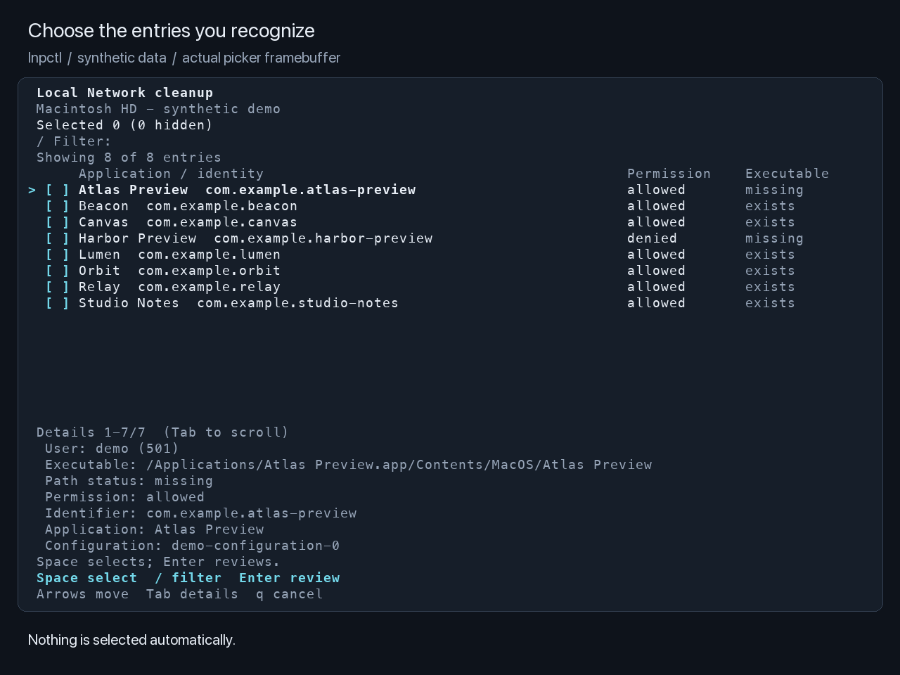

# Local Network Privacy Control

> **Very experimental. Run it at your own risk and peril.**
> This uses private CoreFoundation APIs and directly edits an undocumented macOS configuration format. A bug, a wrong selection, or a macOS update could break network access or damage settings. Backups and validation checks are not a guarantee. Back up your Mac first, and try a disposable VM before a machine you depend on. If you cannot afford to troubleshoot Recovery, do not run this.

Select and remove stale macOS Local Network permission entries using a keyboard-driven table. Prepare a backup during normal use, apply the change from Recovery, and restore a selected backup if needed.

lnpctl is an Objective-C tool for Apple silicon Macs. Building requires Xcode or Command Line Tools. The executable uses Apple's system libraries, including ncurses, and needs no Python or Homebrew to run. It targets macOS 15 or later. The permission-store workflow has only been tested on macOS 27 beta 7; that does not establish support for other versions. See [validation](docs/validation.md).

## Demo

[Watch the 22-second walkthrough](docs/media/lnpctl-demo.mp4): select an entry, filter, add another, and review the full selection.



[Filtering with a hidden selection](docs/media/03-filter.png) · [Reviewing both selections](docs/media/05-review.png)

These images render the real picker framebuffer with fictional entries and added captions. The walkthrough ends after confirming the selection; it does not create a backup or demonstrate a Recovery write. See [media reproduction notes](tools/demo/README.md).

## Build and open

```sh
make
sudo ./build/lnpctl
```

Keep this project somewhere local. The picker reads the current permission store; opening it does not change permissions or create a backup. When you prepare a cleanup, it also stages a small Recovery launcher inside the private backup directory on the Data volume. No additional runtime is installed.

| Key | Action |
| --- | --- |
| Up / Down | Move through the table |
| Page Up / Page Down, Home / End | Navigate a long list |
| Space | Select or deselect the highlighted entry |
| `/` | Filter by application, identity, path, permission, or user |
| Enter / Esc while filtering | Keep / cancel the filter |
| Ctrl-U while filtering | Clear the filter |
| Tab | Move between the table and scrollable details |
| Enter | Review all selected entries |
| `p` in the review screen | Create the backup and prepare the cleanup |
| Esc in the review screen | Return to selection |
| `q` (outside filtering) / Ctrl-C | Cancel |

Nothing is selected automatically. Selections survive filtering. The selected and hidden counts remain visible even in a narrow terminal; filtering shows its own text-entry controls. While filtering, Space and `q` are ordinary text. The review lists every selection and can be scrolled. The terminal must be at least 40 columns by 16 rows; 100 by 30 is more comfortable. `NO_COLOR=1` disables color.

Application names are derived from the recorded `.app` path when available; otherwise the signing identifier is shown. The details pane starts with the user and executable path so similar entries are easier to distinguish. All fields, including the complete path and identity, remain available by scrolling. A missing executable is a clue, not proof that an entry is unwanted. `Not recorded` means the rule has no executable path; the utility does not infer that the application is absent. Internal default-policy rules are never offered for removal.

## Prepare and apply

[Illustrated Recovery guide](docs/recovery-walkthrough.md) · [60-second Recovery walkthrough](docs/media/recovery/lnpctl-recovery.mp4). Tart screenshots from startup options through mounting Data, applying a prepared cleanup, and rebooting.

1. Close applications whose permissions you intend to clean up and close System Settings.
2. Run `sudo ./build/lnpctl`, select the known unwanted entries, press Enter to review them, then `p` to prepare.
3. The tool prints the complete checklist below. **Save it on your phone, photograph it, or print it before shutting down.** The dated backup folder does not need to be remembered: the Recovery launcher lists backups by date and removal count. Backups default to `/Users/Shared/lnpctl/backups/` and contain the original plist, edited copy, manifest, their own executable, and `RECOVERY.txt`. Live permissions are unchanged.
4. Save your work and choose **Apple menu → Shut Down**. Wait until the Mac is fully off.
5. Press and hold the power button. Release it when startup options appear. Choose **Options → Continue**. If asked, choose your startup disk, then select a user and enter that user's login password. [Apple's Recovery instructions](https://support.apple.com/en-us/102518).
6. In Recovery, open **Disk Utility → View → Show All Devices**. Select the **Data** volume belonging to your startup disk and click **Mount** or **Unlock** if needed. Enter the password if prompted. Quit Disk Utility.
7. From the menu bar, open **Utilities → Terminal**. List the mounted volumes:

   ```sh
   ls /Volumes
   ```

   If the Data volume is mounted as `Data`, run the fixed entry point:

   ```sh
   '/Volumes/Data/Users/Shared/lnpctl/backups/lnpctl-recovery'
   ```

   If its mount name differs, replace `Data` with that name, keeping the quotes. For example: `'/Volumes/Macintosh HD/Users/Shared/lnpctl/backups/lnpctl-recovery'`. If the file is missing, check that the Data volume is mounted and unlocked. Avoid a wildcard that could launch an executable from a different attached disk.
8. Enter the backup number for the date and removal count you prepared. Review the complete selection. Enter `a` to apply, then `y` at the final confirmation. Invalid backups and backups belonging to a different volume cannot be selected. Recovery commands accept either letter case; `q` or Return leaves the menu, and an empty final confirmation cancels.
9. After the tool reports successful installation and verification, run:

   ```sh
   reboot
   ```

10. Log in normally. Check **System Settings → Privacy & Security → Local Network** and test the retained application's network connection.

For custom backup locations, preparation stages the launcher inside that backup parent and prints its corresponding stable command. The default launcher is `/Users/Shared/lnpctl/backups/lnpctl-recovery` during normal macOS use. It stays inside the protected backup directory because the Data-volume root can be writable by the admin group. Its only job is to list and validate backups, then start the selected backup's own verified executable; updating the launcher leaves those executables and selections intact.

### If you already prepared a backup with an earlier version

Install the protected launcher and print the full checklist without repeating selection:

```sh
sudo ./build/lnpctl setup-recovery
```

Use `--backups DIRECTORY` for a custom backup parent. This leaves existing backups and the live permission store unchanged. Use the new printed command instead of the older `/Volumes/Data/lnpctl-recovery` command; setup does not remove the old launcher or rewrite existing `RECOVERY.txt` files. Each older backup still runs its original executable, so it does not gain the new editor safeguards. Prepare a fresh cleanup with 0.1.2 or newer for those safeguards. A backup beneath a user-controlled ancestor is refused; prepare a new backup at the default location instead.

Leave SIP enabled. Safe Mode did not permit writes in our tests. Recovery entry and FileVault authentication are manual; this utility does not change startup security or automate rebooting.

The tool identifies the Data volume by its UUID, verifies the prepared change, and refuses to write the currently booted Data volume. If the source or its metadata changed after preparation, it refuses the cleanup. Return to normal macOS and prepare a fresh backup; do not force an old plan onto the changed store.

## Restore a backup

Repeat the shutdown, Recovery and volume-unlock steps above, then run the same launcher:

```sh
'/Volumes/Data/Users/Shared/lnpctl/backups/lnpctl-recovery'
```

Choose the backup number, review it, enter `r`, and confirm with `y`. After success, run `reboot` and verify the settings. Restore-safety snapshots offer restore only.

Restore replaces the entire main NetworkExtension plist, so it also reverts later permission or configuration changes represented in that file. Before replacement, the current state is saved and verified as a separate `restore-safety-...` backup. Those snapshots appear in the backup list and can themselves be restored.

## Noninteractive commands

```sh
# Read-only inventory; JSON includes tokens tied to this exact snapshot.
./build/lnpctl list --json

# Prepare explicitly selected tokens from that exact scan.
sudo ./build/lnpctl prepare \
  --entry '<token>' --entry '<another-token>' \
  --backup '/Users/Shared/lnpctl/backups/my-cleanup'

# Use a different backup parent for the interactive picker.
sudo ./build/lnpctl select --backups '/Users/Shared/lnpctl/my-backups'

# Review a backup, or enumerate backup validity.
sudo ./build/lnpctl inspect '/Users/Shared/lnpctl/backups/my-cleanup' --json
sudo ./build/lnpctl backups --json

# Install or update the stable Recovery handoff for existing backups.
sudo ./build/lnpctl setup-recovery
```

`--volume ROOT` explicitly chooses a mounted Data volume. Apply and restore otherwise locate the mounted volume matching the backup UUID. `--yes` skips the final apply/restore prompt for an already reviewed operation; it does not skip validation. Apply and restore require root and an offline target; preparation requires root. Read-only inventory does not require root when the store is readable.

## Data integrity and scope

- The editor removes selected references from Local Network rule arrays. It preserves other archive objects and metadata, including other users' rules and other NetworkExtension configurations. It does not unarchive or instantiate Apple's private classes.
- Selections are bound to the complete scanned file. A changed snapshot invalidates old tokens. Missing, malformed, shared, or unfamiliar archive structures fail before a write.
- Backups must be on the target APFS volume, in a private root-owned directory. Every ancestor must also be root-owned and protected from replacement. Root-owned sticky directories such as `/Users/Shared` are supported; user-owned home directories, nonsticky writable parents, and ancestor ACLs granting mutation access are refused. macOS-protected firmlink directories are accepted where their no-unlink flag protects the path. Existing files are never overwritten during preparation. The executable staged with the backup must match the one performing apply or restore.
- The replacement preserves ownership, mode, extended attributes, and ACLs. Files with filesystem flags or multiple hard links are rejected. The replacement is written and synced separately, checked again, then renamed over the offline store.
- Checksums detect corruption; they are not protection against someone who can rewrite the root-owned backup and executable. A backup contains private application and configuration information.

This works with the serialized private file `/Library/Preferences/com.apple.networkextension.plist`, using the private CoreFoundation functions `_CFKeyedArchiverUIDGetValue` and `_CFKeyedArchiverUIDGetTypeID` to inspect archive references. These functions inspect the data; the tool itself removes selected rule references and rewrites the plist. Both the private APIs and the undocumented file format may change across macOS versions. It does not edit TCC or use a supported Apple reset API. Unknown schema or serialization changes are grounds for refusal. Read the source before trusting it with your settings. Each backup includes the executable that prepared it.

## Tests

```sh
make test
```

The standard-library test suite checks archive preservation, cross-user selection, stale tokens, malformed inputs, and real ncurses keyboard behavior in pseudo-terminals. Filesystem and Recovery validation are described in [validation](docs/validation.md). Test scripts that write a store belong in a disposable VM you control or its dedicated test disk image.

## Website

The landing page, guide, and demonstration media live in [site/](site/README.md). The website has a separate Node build; no Node dependencies are needed to build or run the CLI. Account-specific deployment configuration and local credentials are excluded from Git.

## CI and distribution

GitHub Actions runs the CLI tests on macOS 15 and 26. Version tags can produce a Developer ID signed, notarized DMG once the signing environment is configured; see [release setup](docs/releases.md). Downloads remain private while this repository is private.

The static website can deploy from `main` to GitHub Pages. See [Pages setup](docs/github-pages.md) for the build, publishing permissions, and site URL.
